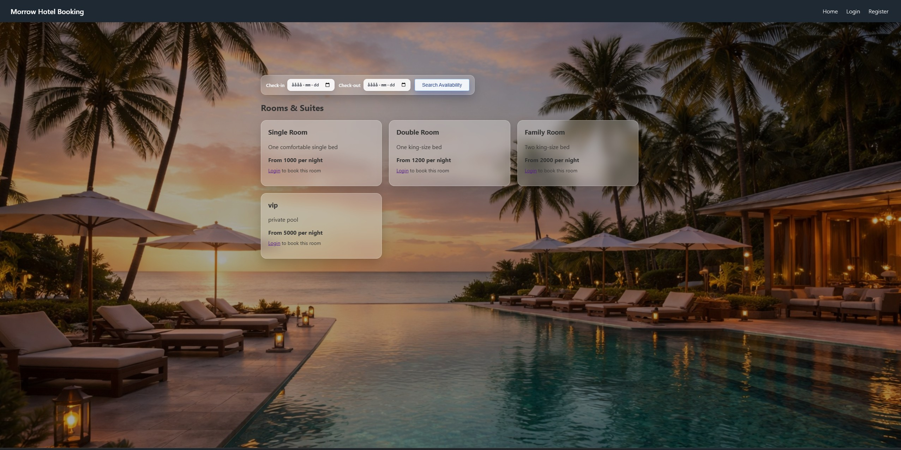

---
# Morrow Hotel Booking System

## 📷 Project Preview



## Overview
Morrow Hotel Booking System is a web application for managing hotel room reservations. It allows users to register, log in, view available rooms, and manage their bookings. Admins can manage rooms and review bookings through a dedicated dashboard.

## User Flow

### User
1. Register an account
2. Log in
3. Browse available rooms
4. Filter rooms by check-in/check-out dates
5. Select a room and book
6. View and manage personal bookings (cancel, pay)

### Admin
1. Log in to admin dashboard
2. Add or delete rooms
3. View all bookings


## Features

- User registration & login (session-based)
- View available rooms
- Filter rooms by check-in/check-out dates
- View and manage personal bookings
- Admin dashboard for room management
- Add and delete rooms
- View all bookings

### Booking Rules
- No overlapping bookings for the same room
- Check-out must be after check-in

## Tech Stack

**Backend:**
- FastAPI
- SQLAlchemy ORM
- MariaDB / MySQL
- Jinja2 Templates
- Starlette Sessions
- uvicorn

**Frontend:**
- Jinja2 HTML templates
- CSS (custom or framework-based)

## Requirements

Install all dependencies listed in requirements.txt:
```
fastapi
uvicorn
SQLAlchemy
Jinja2
passlib[bcrypt]
python-dotenv
python-multipart
email-validator
itsdangerous
PyMySQL
```
Install with:
```
pip install -r requirements.txt
```

## Setup & Usage

1. Clone the repository and navigate to the project directory.
2. Create and activate a Python virtual environment.
3. Install dependencies with `pip install -r requirements.txt`.
4. Configure your database settings in `.env` or the backend config.
5. Run the backend server:
  enter backend
   ```
   python -m uvicorn main:app --reload
   ```
6. Access the site at `http://localhost:8000`.


